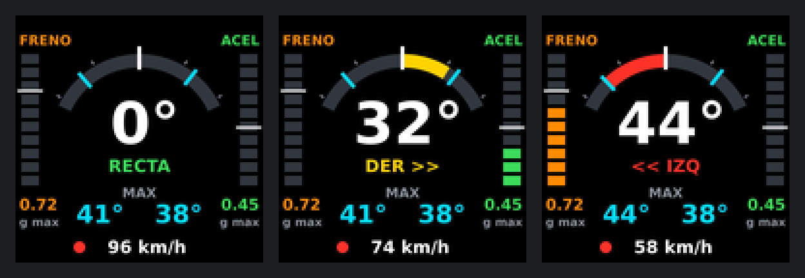

# Inclinómetro para moto (MotoLean)

Inclinómetro casero para moto basado en una placa **LOLIN S3 Mini Pro** (ESP32-S3 con pantalla de 0,85" y sensor de movimiento integrado). Muestra la inclinación en directo, la máxima a cada lado y la máxima aceleración y frenada, y lo enseña también en el móvil por WiFi.



## Qué hace

- **Inclinación en directo**, con arco de color: azul hasta 25°, amarillo hasta 40°, rojo a partir de ahí.
- **Máxima inclinación** a izquierda y derecha.
- **Aceleración y frenada** en g, con barra en directo y máximo alcanzado.
- **Memoria**: los máximos y la calibración se conservan al apagar.
- **Móvil**: página web propia por WiFi, sin instalar ninguna app.
- **Montaje libre**: una calibración de dos pasos permite colocar la placa en cualquier posición.

## Material

| Pieza | Detalle |
|---|---|
| Placa | LOLIN (WEMOS) S3 Mini Pro v1.1.0, versión con pantalla ST7789 |
| Alimentación | 5 V por USB-C (toma USB de la moto) |
| Soporte | Dos piezas impresas en PETG, 4 tornillos M2 × 8–10 mm, 2 bridas de hasta 4,8 mm y una tira de goma |

No hace falta ningún sensor adicional ni soldar nada.

## Puesta en marcha

1. **Cargar el firmware** ya compilado desde el navegador: [docs/CARGAR_FIRMWARE.md](docs/CARGAR_FIRMWARE.md).
2. **Imprimir y montar el soporte**: [docs/SOPORTE.md](docs/SOPORTE.md).
3. **Calibrar y usar**: [docs/USO.md](docs/USO.md).

## Documentación

| Documento | Contenido |
|---|---|
| [docs/CARGAR_FIRMWARE.md](docs/CARGAR_FIRMWARE.md) | Cómo grabar el `.bin` en la placa sin instalar nada |
| [docs/USO.md](docs/USO.md) | Botones, calibración, pantalla y conexión con el móvil |
| [docs/SOPORTE.md](docs/SOPORTE.md) | Soporte de manillar: medidas, impresión y montaje |
| [docs/COMPILAR.md](docs/COMPILAR.md) | Cómo compilar el programa desde el código fuente |
| [docs/FUNCIONAMIENTO.md](docs/FUNCIONAMIENTO.md) | Cómo se calcula la inclinación y qué limitaciones tiene |
| [docs/HARDWARE.md](docs/HARDWARE.md) | Pines y componentes de la placa |
| [CHANGELOG.md](CHANGELOG.md) | Historial de versiones |

## Estructura del repositorio

```
firmware/
  moto_inclinometro/   Código fuente (Arduino)
  bin/                 Firmware compilado, listo para grabar
soporte/               STL del soporte y script que los genera
herramientas/          Simulador de la pantalla (genera la imagen de arriba)
docs/                  Documentación e imágenes
```

## Estado del proyecto

| Parte | Estado |
|---|---|
| Firmware | Cargado y funcionando en la placa. Pendiente de probar en marcha |
| Pantalla nueva (arco y barras) | Cargada y funcionando en la placa |
| Soporte | Diseñado para la anchura de manillar calculada (tubo de 28,6 mm) 

## Aviso de seguridad

Es un proyecto de aficionado y la medida es orientativa. No mires la pantalla en plena curva ni la uses como referencia para apurar la inclinación.

## Licencia

Proyecto publicado bajo licencia [MIT](LICENSE).
