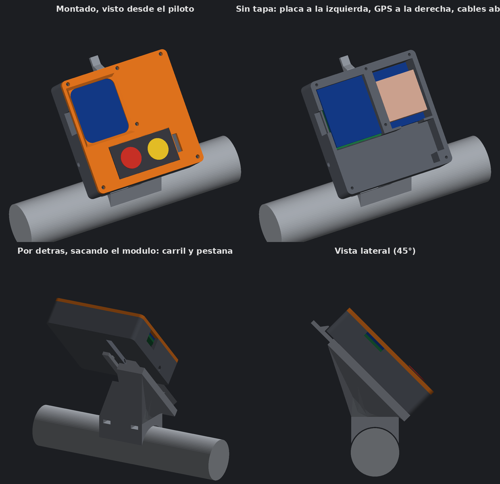

# Caja para la placa Waveshare ESP32-S3-LCD-1.69

Caja desmontable para la placa de 1,69", el GPS con su antena y la botonera de dos botones. **Primera versión: todavía no se ha impreso ni probado.**

## Piezas

| Archivo | Pieza | Cómo imprimirla |
|---|---|---|
| `soporte/caja_169/caja169_base.stl` | Base fija al manillar, con carril y pestaña | Como viene, con el carril hacia arriba; necesita soportes bajo el cuello |
| `soporte/caja_169/caja169_modulo.stl` | Módulo con placa, GPS y cables | Apoyado sobre su trasera, sin soportes |
| `soporte/caja_169/caja169_tapa.stl` | Tapa con ventana y asiento de la botonera | Con la cara interior sobre la cama, sin soportes |

Cada pieza tiene también su `.step` para abrirla y modificarla en Fusion, y `caja169_conjunto.step` trae las tres montadas.

Material: PETG. Medidas exteriores del módulo con tapa: 70 × 70,5 × 19,4 mm.

## Distribución (vista desde el piloto)

- **Arriba a la izquierda:** la placa, con el USB-C hacia la pared izquierda, que tiene una entrada para el cable.
- **Arriba a la derecha:** el GPS al fondo y la antena encima, bajo la tapa.
- **Abajo:** hueco de 25 mm para el mazo de 12 cables y el cable plano de la botonera.
- **Sobre la tapa, abajo:** asiento de 40,6 × 20,6 mm para pegar la botonera, y a su derecha una ranura de 3,2 × 11,2 mm por la que pasan el conector y el cable plano.

## Montaje

1. La placa apoya en cuatro pilares con un tetón de 1,2 mm que entra en cada taladro. La sujeta la tapa, que pisa el borde del cristal.
2. La tapa se cierra con seis tornillos autorroscantes de 2 mm.
3. El módulo entra deslizando de arriba abajo en el carril de la base hasta que salta la pestaña. Un tornillo M3 opcional lo bloquea por el lateral.
4. La base se sujeta al manillar con dos bridas.

## Pendiente de comprobar

- La posición vertical de la ventana supone que la imagen empieza 1,5 mm por debajo del borde superior de la placa.
- El manillar se ha supuesto de 28,6 mm, como en la caja anterior.

Para regenerar los archivos: `python3 soporte/generar_caja_169.py` (necesita `cadquery`, `trimesh` y `pillow`).
