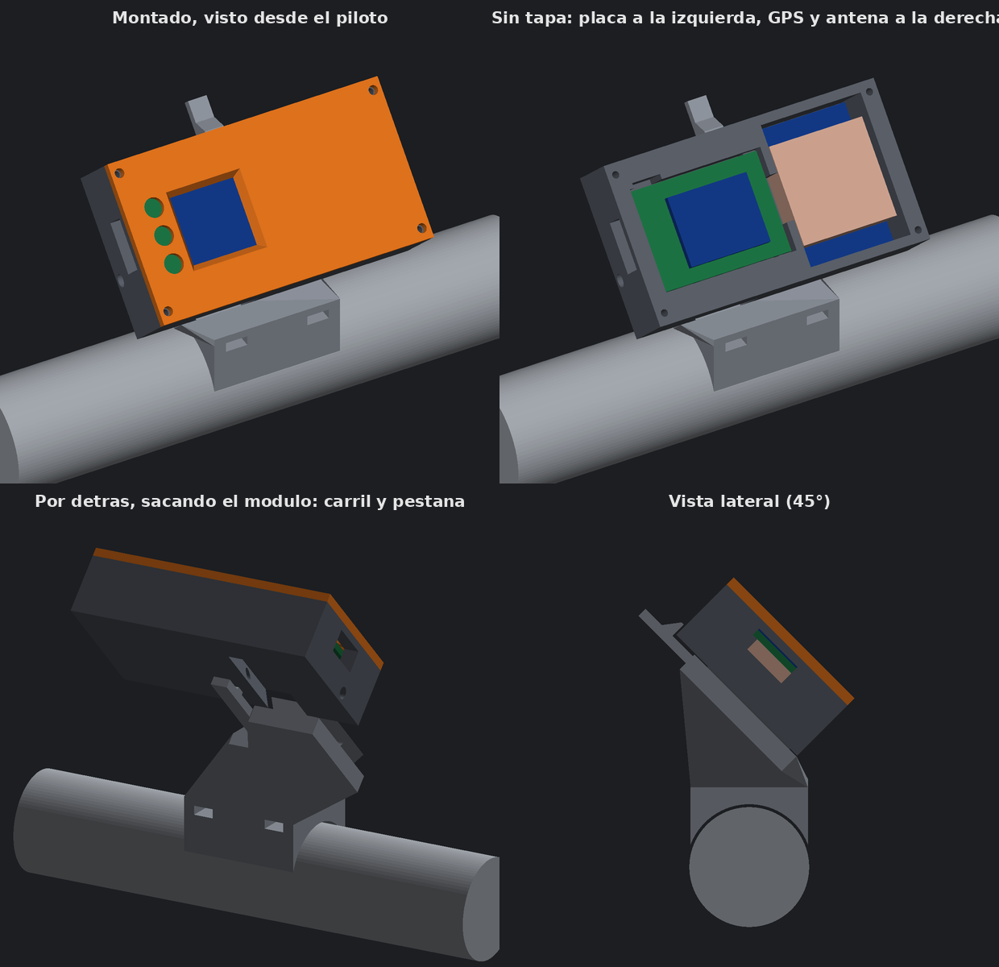

# Caja desmontable con GPS

Caja para llevar juntas la placa, el GPS y la antena, en dos partes: una **base** que se queda en la moto y un **módulo** con la electrónica que se quita y se pone sin herramientas.



> Las imágenes son vistas del modelo 3D. **Esta caja aún no se ha impreso ni probado.**

## Piezas

| Archivo | Pieza | Cómo imprimirla |
|---|---|---|
| [`soporte/gps_base.stl`](../soporte/gps_base.stl) | Base de manillar con carril y pestaña de cierre | Con el carril hacia arriba (así viene); necesita soportes debajo |
| [`soporte/gps_modulo.stl`](../soporte/gps_modulo.stl) | Módulo con los huecos de placa, GPS y antena | Apoyado sobre su trasera, sin soportes |
| [`soporte/gps_tapa.stl`](../soporte/gps_tapa.stl) | Tapa con ventana y agujeros de botones | Plana, sin soportes |
| [`soporte/soporte_pulsadores_x3.stl`](../soporte/soporte_pulsadores_x3.stl) | Pulsadores | Los mismos del soporte sencillo |

## Cómo se engancha

- El módulo tiene una ranura en cola de milano en la trasera y la base un carril con la misma forma.
- Se mete **de arriba abajo** hasta que hace tope. El peso y los baches lo empujan hacia el tope, no hacia fuera.
- Al llegar al tope, una **pestaña** de la base salta sobre el borde superior del módulo y lo bloquea.
- Para sacarlo: empuja la pestaña hacia atrás con el pulgar y tira del módulo hacia arriba. Antes hay que desenchufar el USB.
- **Seguro opcional:** un agujero de 3,4 mm atraviesa el módulo y el carril por el lado izquierdo. Con un tornillo M3 de 30 mm, o una brida fina, el módulo no puede salir aunque fallara la pestaña.

## Distribución interior

| Zona | Medidas del hueco | Contenido |
|---|---|---|
| Izquierda | 35,2 × 26,2 mm, 7,45 mm de fondo, con apoyos para que la placa quede recta | Placa principal, con los botones a la izquierda y el USB saliendo por el lateral izquierdo |
| Derecha | 27 × 36 mm, 15 mm de fondo | Placa del GPS al fondo y la antena encima, pegada a la tapa |
| Entre ambas | Paso de 12 mm | Los 4 cables del GPS |

Tamaño del módulo con tapa: 73 × 40,8 × 19,4 mm. El módulo queda centrado sobre el manillar y la pantalla a 45° hacia el piloto.

## Medidas usadas

| Pieza | Medida (calibre) |
|---|---|
| Placa del GPS | 35,44 × 26,41 × 4,03 mm, sin contar los pines |
| Antena | 25,08 × 25,14 × 9,00 mm |
| Placa principal | 34,50 × 25,43 mm |
| Manillar | 28,6 mm, valor calculado, sin medir en la moto |

## Antes de montar

- **Pines del GPS:** el hueco no deja sitio para la tira de pines. Hay que desoldarla o cortarla y soldar los cables directamente.
- **Antena:** va tumbada sobre la placa del GPS, con la cara cerámica hacia la tapa. Conviene fijarla con cinta de doble cara de espuma para que no vibre.
- **Cable de antena:** queda recogido dentro de la zona derecha.

## Dudas abiertas

- La antena queda inclinada 45° como la pantalla, no horizontal. Debería recibir bien, pero no está probado.
- Holgura del carril de 0,3 mm por lado: puede salir justa o floja según la impresora.
- La pestaña trabaja a flexión y se imprime inclinada; si se rompe o queda blanda habrá que engordarla.

## Modificar el diseño

```bash
pip install trimesh manifold3d numpy pillow
python3 soporte/generar_caja_gps.py     # desde la raíz del repositorio
```
