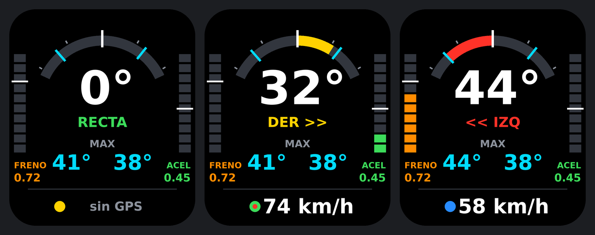

# Versión para Waveshare ESP32-S3-LCD-1.69 (firmware 3.0)

Adaptación del inclinómetro a la placa **Waveshare ESP32-S3-LCD-1.69** (sin táctil): pantalla de 1,69" y 240×280 puntos, con el mismo sensor de movimiento QMI8658.

> **Estado: compila, pero todavía no se ha probado en una placa real.** Los puntos pendientes de comprobar están al final.



## Pantalla

- **Número grande**: inclinación actual. Entre −4° y +4° la moto se considera **RECTA**.
- **Arco de color** y máximos a izquierda y derecha.
- **Barras laterales**: aceleración y frenada.
- **Fondo rojo parpadeante** al pasar de 40° de inclinación.
- **Icono GPS (arriba a la izquierda)**: rojo parpadeando sin señal, verde fijo con señal. Un punto rojo al lado indica que se está grabando ruta.
- **Icono WiFi (arriba a la derecha)**: gris sin conexión, verde cuando está unido a la WiFi de casa o hay un móvil conectado a la red `MotoLean`.
- La velocidad no se muestra en pantalla (sí se graba en la ruta).

## Botones

| Botón | Pulsación | Acción |
|---|---|---|
| BOOT | breve | Girar la pantalla 180° |
| BOOT | 3 s | Calibración completa en dos pasos (moto recta + moto en la pata) |
| PWR | breve | Ajuste de centro: pone a cero con la moto recta. Solo se acepta si el desvío es menor de ±10° |
| PWR | 1,5 s | Terminar o reanudar la ruta |

Todo ello está también en la página web, en `/ajustes`.

Los máximos se ponen a cero al empezar cada ruta, y siguen a la vista después de terminarla.

## Conexión del GPS (NEO-6M)

| GPS | Placa |
|---|---|
| VCC | 3V3 |
| GND | GND |
| TX | GPIO17 |
| RX | GPIO18 |

## Cargar el firmware

Fichero: [`firmware/bin/MotoLean_169_firmware.bin`](../firmware/bin/MotoLean_169_firmware.bin)

1. Mantener pulsado **BOOT** mientras se conecta el USB.
2. Abrir <https://espressif.github.io/esptool-js/> en Chrome o Edge, pulsar *Connect* y elegir el puerto.
3. Dirección **0x0**, seleccionar el fichero y pulsar *Program*.
4. Desconectar y volver a conectar el USB.

**No vale el fichero `MotoLean_firmware.bin`**, que es el de la placa LOLIN.

## Compilar

Placa `ESP32S3 Dev Module`, USB CDC On Boot activado, Flash 16MB, partición `16M Flash (3MB APP/9.9MB FATFS)`, PSRAM `OPI`. En TFT_eSPI se usa la configuración [`Setup_Waveshare_169.h`](../firmware/moto_inclinometro_169/Setup_Waveshare_169.h).

```
arduino-cli compile --fqbn esp32:esp32:esp32s3:CDCOnBoot=cdc,FlashSize=16M,PartitionScheme=app3M_fat9M_16MB,PSRAM=opi firmware/moto_inclinometro_169
```

## Pendiente de comprobar en la placa

- Colores de la pantalla (orden de color e inversión). Si salen cambiados o en negativo se corrige en una línea.
- Botón PWR: se ha supuesto que da nivel alto al pulsarlo, según la documentación.
- El zumbador de la placa no se usa.
- Las cajas impresas del repositorio son para la LOLIN y no sirven para esta placa.
