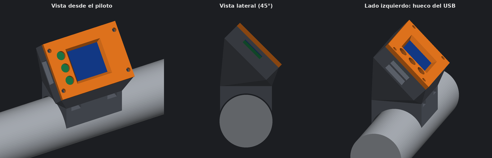

# Soporte de manillar

Soporte impreso en 3D para fijar la placa al centro del manillar con la pantalla inclinada 45° hacia el piloto. Diseñado para la Honda Africa Twin 1100 (2021), con tubo de 28,6 mm en la zona central.



> **Medida del manillar calculada, no medida.** El soporte está dimensionado para un tubo de **28,6 mm de diámetro** (más 0,7 mm de holgura para la goma), que es el valor estándar calculado para la zona central del manillar de la Africa Twin 1100. No se ha medido sobre la moto: comprueba el diámetro con un calibre antes de imprimir y, si es distinto, cambia `RB` en `soporte/generar_soporte.py` y regenera los STL.

> Las imágenes son vistas del modelo 3D. **El soporte aún no se ha impreso ni probado.** Cuando esté impreso, las fotos reales deben ir en `docs/img/`.

## Piezas

| Archivo | Pieza |
|---|---|
| [`soporte/soporte_cuerpo.stl`](../soporte/soporte_cuerpo.stl) | Base de apoyo al manillar, cuello a 45° y caja de la placa |
| [`soporte/soporte_tapa.stl`](../soporte/soporte_tapa.stl) | Tapa con ventana para la pantalla y agujeros de los botones |
| [`soporte/soporte_pulsadores_x3.stl`](../soporte/soporte_pulsadores_x3.stl) | Los tres pulsadores, colocados para imprimir juntos |
| [`soporte/soporte_pulsador.stl`](../soporte/soporte_pulsador.stl) | Un pulsador suelto, por si hay que repetir alguno |

## Medidas principales

| Elemento | Medida |
|---|---|
| Tamaño total | 44 × 32 × 47 mm aprox. |
| Tubo de manillar | 28,6 mm (valor calculado, sin medir en la moto), con 0,7 mm de holgura para una goma |
| Ancho ocupado en el tubo | 34 mm |
| Túneles para bridas | 2, para bridas de hasta 4,8 mm |
| Hueco de la placa | 35,2 × 26,2 mm, 7,45 mm de fondo, con dos apoyos de 3,4 mm en el extremo de la pantalla |
| Ventana de pantalla | 17,7 × 16,5 mm por dentro, con los bordes en bisel |
| Agujeros de botones | 3 de 5,0 mm, separados 7,1 mm y centrados en la placa |
| Pulsadores | Vástago de 4,6 mm que sobresale 3 mm; ala interior de 6,4 × 0,8 mm |
| Hueco del USB-C | 13 × 6,5 mm, en el lateral izquierdo |
| Tornillos de la tapa | 4 × M2, agujero de 1,8 mm en el cuerpo y 2,4 mm en la tapa |

La placa va apaisada, con los botones a la izquierda y el cable USB saliendo por ese mismo lado.

## Medidas sin confirmar

- **Ventana y botones**: recolocados con medidas de calibre (placa de 34,50 × 25,43 mm, cristal de 17,63 × 21,38 mm, botones cada 7,1 mm). La distancia de los botones al borde (2,9 mm) sigue saliendo de fotos. Esta tapa corregida está pendiente de imprimir y probar.
- **USB**: su posición se tomó de fotos de la placa junto a una regla, con un error de alrededor de 1 mm.
- **Fondo del hueco**: sale de medidas de calibre (conector USB 3,35 mm, cristal 1,85 mm y punta de los botones 2,03 mm sobre la placa blanca). El grosor de la placa (1,7 mm) está deducido, no medido, por eso se dejan 0,5 mm de holgura sobre el cristal.
- **Diámetro del manillar**: se usa el valor estándar de 28,6 mm, sin medirlo en la moto.

Por eso conviene **imprimir primero solo la tapa** y presentarla sobre la placa antes de imprimir el cuerpo.

## Impresión

| Parámetro | Valor orientativo |
|---|---|
| Material | PETG (aguanta sol y calor mejor que el PLA) |
| Altura de capa | 0,2 mm |
| Perímetros | 3–4 |
| Relleno | 30–40 % |
| Tapa | Plana sobre la cama, sin soportes |
| Cuerpo | Necesita soportes en el arco del manillar y en los túneles de las bridas |

## Montaje

1. Presenta la tapa sobre la placa y comprueba que ventana y agujeros coinciden.
2. Mete la placa en el cuerpo, con el USB hacia el hueco lateral izquierdo.
3. Cierra la tapa con los 4 tornillos M2.
4. Coloca una tira de goma de 0,5–1 mm entre la base y el manillar.
5. Sujeta con dos bridas pasadas por los túneles.
6. Con todo montado, [calibra](USO.md#calibración) y endereza la imagen con el botón verde.

## Pulsadores

Cada pulsador tiene forma de seta: el vástago asoma por el agujero de la tapa y el ala queda por dentro, así que no puede salirse. Van sueltos, sin tornillos ni pegamento.

La tapa queda a 0,5 mm del cristal y tiene por dentro un rebaje de 0,73 mm sobre los botones. Ahí se aloja el ala de 0,8 mm de cada pulsador, con 0,25 mm de juego para que el botón no quede apretado al cerrar.

- Se imprimen con el ala apoyada en la cama, sin soportes.
- Para montarlos, pon la tapa boca abajo, mete los tres vástagos en sus agujeros desde dentro y coloca el cuerpo encima antes de darle la vuelta.
- Si rozan en el agujero, repasa el vástago con una lija fina.

Pendientes de imprimir y probar.

## Pendiente

- **Estanqueidad**: la ventana está abierta. Para lluvia hay que pegar una lámina transparente por dentro y sellar la salida del cable.

## Modificar el diseño

El soporte se genera con [`soporte/generar_soporte.py`](../soporte/generar_soporte.py). Las medidas están al principio del archivo.

```bash
pip install trimesh manifold3d numpy pillow
python3 soporte/generar_soporte.py     # desde la raíz del repositorio
```

Regenera los dos STL y la imagen `docs/img/soporte.png`.
